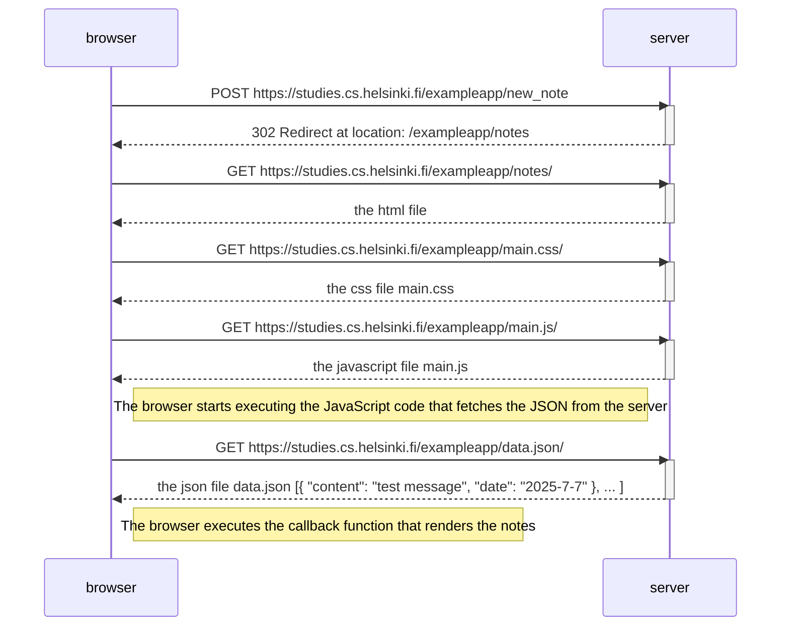

```mermaid
sequenceDiagram
  participant browser
  participant server

  browser->>server: POST https://studies.cs.helsinki.fi/exampleapp/new_note
  activate server
  server-->>browser: 302 Redirect at location: /exampleapp/notes
  deactivate server

  browser->>server: GET https://studies.cs.helsinki.fi/exampleapp/notes/
  activate server
  server-->>browser: the html file
  deactivate server

  browser->>server: GET https://studies.cs.helsinki.fi/exampleapp/main.css/
  activate server
  server-->>browser: the css file main.css
  deactivate server

  browser->>server: GET https://studies.cs.helsinki.fi/exampleapp/main.js/
  activate server
  server-->>browser: the javascript file main.js
  deactivate server

  Note right of browser: The browser starts executing the JavaScript code that fetches the JSON from the server

  browser->>server: GET https://studies.cs.helsinki.fi/exampleapp/data.json/
  activate server
  server-->>browser: the json file data.json [{ "content": "test message", "date": "2025-7-7" }, ... ]
  deactivate server

  Note right of browser: The browser executes the callback function that renders the notes
```
