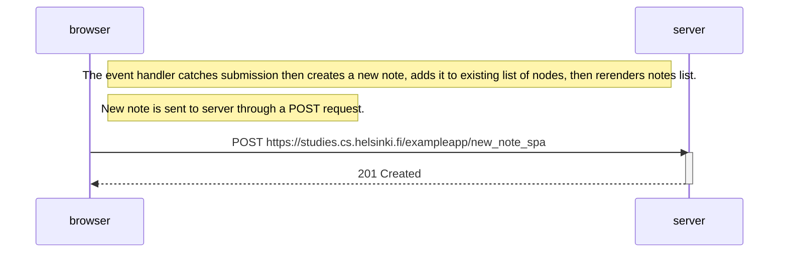

```mermaid
sequenceDiagram
  participant browser
  participant server

  Note right of browser: The event handler catches submission then creates a new note, adds it to existing list of nodes, then rerenders notes list.

  Note right of browser: New note is sent to server through a POST request.

  browser->>server: POST https://studies.cs.helsinki.fi/exampleapp/new_note_spa
  activate server
  server-->>browser: 201 Created
  deactivate server
```
